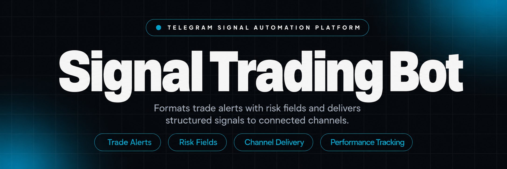
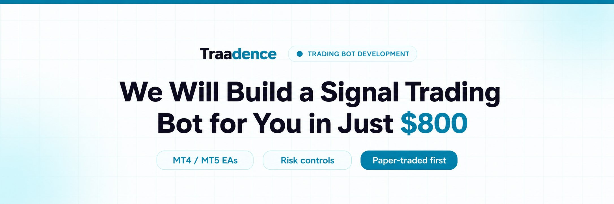
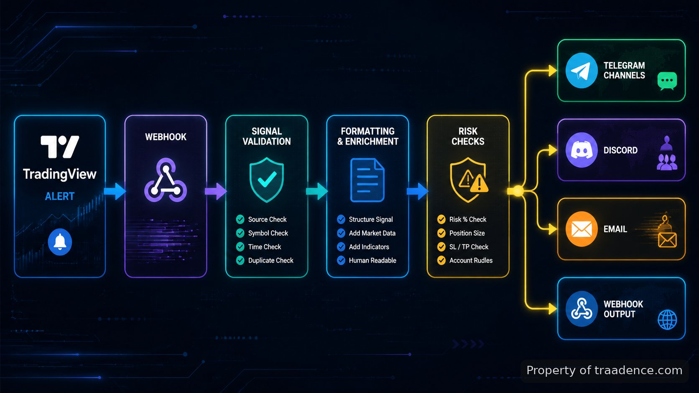

<p align="center">
  <a href="https://www.traadence.com/bot/telegram-crypto-signal-bot-ev-ranking" target="_blank" rel="nofollow">
    
  </a>
</p>

## Telegram Signal Trading Bot

Telegram Signal Trading Bot runs as a signal delivery system for publishing structured trade alerts, validating inputs, and distributing updates to trading communities. The repository contains the components used to receive alerts, format LONG and SHORT setups, connect market sources, and send outputs to configured channels. I use the system around a workflow where a trade idea enters through an alert source, passes validation rules, and leaves as a formatted message or connected execution request.

> A trading alert pipeline that turns strategy events into structured subscriber messages.

The main problem it addresses is the gap between generating a trade setup and communicating it consistently. A manual process can lose formatting, omit risk details, or delay delivery. The tool keeps fields such as asset, entry, stop-loss, take-profit levels, direction, strategy name, and confidence score together before publishing.

<a href="https://www.traadence.com/bot/telegram-crypto-signal-bot-ev-ranking" target="_blank" rel="nofollow">
  
</a>

<p align="center">
  <a href="https://t.me/Bitbash333" target="_blank" rel="nofollow">
    
  </a>&nbsp;
  <a href="https://wa.me/923249868488?text=Hi%2C%20I%27m%20interested." target="_blank" rel="nofollow">
    
  </a>&nbsp;
  <a href="mailto:hello@traadence.com" target="_blank" rel="nofollow">
    
  </a>&nbsp;
  <a href="https://www.traadence.com" target="_blank" rel="nofollow">
    
  </a>
</p>

## Core Features

| Feature | Description |
| --- | --- |
| Automated Signal Publishing | Missed alerts and inconsistent posting are removed by sending validated trade setups to Telegram channels, private groups, Discord, email, mobile apps, or webhooks. |
| Trading Signal Formatter | Incomplete messages are reduced by converting raw alerts into templates containing symbol, direction, entry, stop-loss, targets, risk-reward ratio, strategy name, and confidence score. |
| Exchange and Broker Connections | Disconnected market sources are handled through connections for Binance, Bybit, OKX, MT4/MT5, cTrader, and custom broker APIs to fetch data and validate signals. |
| Market Scanner Inputs | Separate scanner outputs and strategy alerts can be combined through indicator-based signals, technical pattern detection, and AI-assisted market analysis. |
| Performance Records | Unclear results after publishing are reduced by recording TP hits, SL hits, win rate, average return, drawdown, and monthly performance measurements. |
| Access and Membership Controls | Manual subscriber administration is reduced through free and premium channel controls, expiry tracking, approval rules, removal actions, and membership tiers. |
| Execution and Position Controls | Risk mistakes are limited through position sizing, percentage settings, daily loss limits, stop-loss enforcement, and portfolio exposure controls. |

## TradingView webhook workflow

A common input path starts with a TradingView webhook. The system receives alert payloads from configured chart strategies, maps the incoming fields, checks required values, and prepares a message for distribution. TradingView webhook behavior is documented in the <a href="https://www.tradingview.com/support/solutions/43000529348-how-to-configure-webhook-alerts/" target="_blank" rel="nofollow">TradingView alert documentation</a>, which describes how external services receive alert HTTP requests.

A typical BTC/USDT example enters with a LONG direction, an entry of 67,500, a stop-loss of 66,800, TP1 at 68,500, TP2 at 69,200, 1% risk, and a 1:2.5 risk-reward ratio. The formatter preserves these values so subscribers receive the same structure every time instead of interpreting different message styles.



## Signal performance tracking

After a signal is published, the tracking layer records what happened next. This helps separate delivered alerts from measured outcomes by storing events such as target completion, stop-loss results, return values, drawdown, and monthly summaries.

The records are useful when reviewing a strategy over time. Instead of checking individual messages manually, the operator can compare published setups against their later outcomes and identify how different strategies or markets behaved.

## Risk management controls

Trading decisions can become inconsistent when position sizing is calculated manually. The risk management layer calculates position size from configured percentages, applies maximum daily loss limits, checks exposure, and enforces stop-loss requirements before execution or publication.

The repository connects these controls with the signal pipeline rather than treating risk as a separate report. Exchange and broker data sources can provide the information needed for validation before a message is released.

Supported exchange connections include documentation references such as the <a href="https://developers.binance.com/docs/binance-spot-api-docs" target="_blank" rel="nofollow">Binance API documentation</a>, <a href="https://bybit-exchange.github.io/docs/v5/intro" target="_blank" rel="nofollow">Bybit API documentation</a>, and <a href="https://www.okx.com/docs-v5/en/" target="_blank" rel="nofollow">OKX API documentation</a>. These references define the external interfaces used for market and account data connections.

## Subscriber management

Managing private communities manually creates access problems when subscriptions change. Subscriber management handles free and premium groups, membership tiers, approval states, expiry tracking, and automatic removal rules.

Telegram delivery relies on bot communication through the <a href="https://core.telegram.org/bots/api" target="_blank" rel="nofollow">Telegram Bot API documentation</a>. The connection allows the system to send formatted messages into configured channels and groups while maintaining the access rules defined by the operator.

<a href="https://tally.so/r/vG5J40?platform=GitHub&amp;format=Product+repo&amp;brand=Traadence&amp;niche=trading&amp;page=Telegram+Signal+Trading+Bot+with+TradingView&amp;date=2026-09-03" target="_blank" rel="nofollow">
  
</a>

## AI signal assistant

Complex trade setups often require additional explanation after publication. The AI signal assistant can explain setups, generate market summaries, answer subscriber questions, analyze charts, and provide educational context around the published signal.

The assistant works alongside the signal workflow rather than replacing the underlying strategy rules. It adds a communication layer for subscribers who need context around why a setup was generated.

## Tech Stack and Runtime

The runtime is organized around API connections, webhook processing, message formatting, database records, and channel delivery services. Python handles service logic and integrations, REST endpoints receive external alerts, and database storage keeps signals, users, settings, and performance history available for reporting.

Trading platform connections follow documented APIs where available. The implementation uses external references such as the <a href="https://www.mql5.com/en/docs/python_metatrader5" target="_blank" rel="nofollow">MetaTrader 5 Python integration documentation</a> and <a href="https://help.ctrader.com/open-api/" target="_blank" rel="nofollow">cTrader Open API documentation</a> when connecting broker-side workflows.

## Project Structure and Runtime Files

```text
telegram-signal-system/
├── src/
│   ├── api/
│   │   └── webhooks.py
│   ├── signals/
│   │   ├── formatter.py
│   │   └── validator.py
│   ├── risk/
│   │   └── position.py
│   └── channels/
│       ├── telegram.py
│       └── discord.py
├── database/
│   └── models.py
├── config/
│   └── settings.py
├── requirements.txt
└── README.md
```

## How to Publish Signals Using Telegram Signal Trading Bot

- **STEP 1 — Download & Set Up the Project** Download, set up, and install **Telegram Signal Trading Bot** to get the project running from the repository package.
- **STEP 2 — Open Dashboard** Access the admin dashboard, review settings, and connect configured channels, market sources, and subscriber options.
- **STEP 3 — Configure Signal Inputs** Select alert modes, enter symbols, webhook fields, strategy settings, risk percentages, and destination channel rules.
- **STEP 4 — Trigger Publishing** Send the configured alert, run validation, and receive formatted signals through selected distribution channels.

## Copy trading workflows

Copy trading workflows are supported when operators need signals to move beyond messages into account actions. The system can execute copied signals, manage multiple user accounts, and apply risk-based position sizing according to configured rules.

## Use Cases

- Publish Forex, Crypto, Stocks, or Futures setups to multiple Telegram communities without rewriting every alert.
- Convert TradingView strategy alerts into structured subscriber messages with consistent entry, target, and risk fields.
- Run premium trading communities with controlled access, expiry tracking, and automated member management.
- Review strategy history using recorded outcomes such as win rate, returns, drawdown, and target results.

## Implementation Notes

The repository is designed around clear movement of data: incoming alert, validation, formatting, risk checks, storage, and delivery. Each stage has a defined responsibility, which makes it easier to inspect where a signal changed before reaching subscribers.

A developer evaluating the system can trace the webhook handler, signal formatter, risk module, database models, and channel connectors independently. The result is a trading communication pipeline that can be adapted around existing strategies and operational rules.

```bash
python -m venv .venv
source .venv/bin/activate
pip install -r requirements.txt
python src/api/webhooks.py
```

## FAQ

### How does the system receive TradingView alerts?

The system receives TradingView alerts through webhook requests, then maps the incoming fields into the signal processing flow. Required values are checked before the formatted message is sent to configured destinations.

### Can the bot distribute signals to private Telegram groups?

Yes. The system supports Telegram channels and private groups through bot-based message delivery. Access rules can be combined with subscriber management features for free and premium communities.

### What exchanges and brokers can connect to the system?

The system supports connections with Binance, Bybit, OKX, MT4/MT5, cTrader, and custom broker APIs. These connections are used for market data access and signal validation workflows.

### How are published signals measured after they are sent?

Published signals are tracked through performance records that monitor outcomes including TP hits, SL hits, win rate, average return, drawdown, and monthly performance summaries.